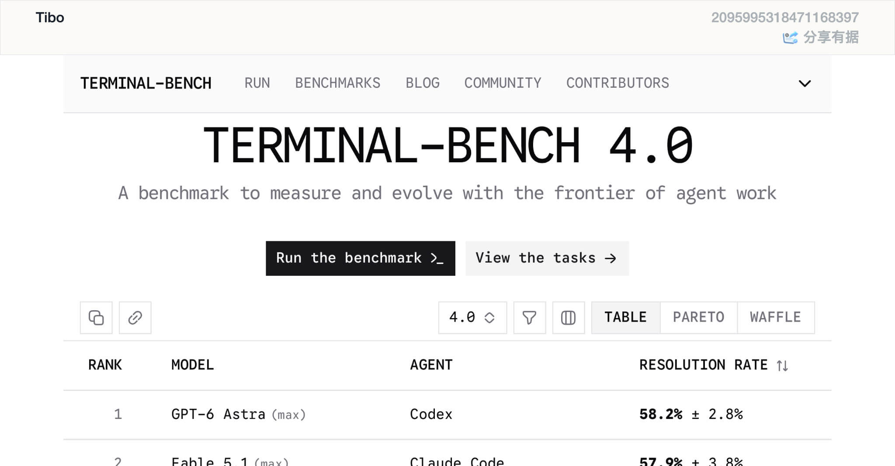
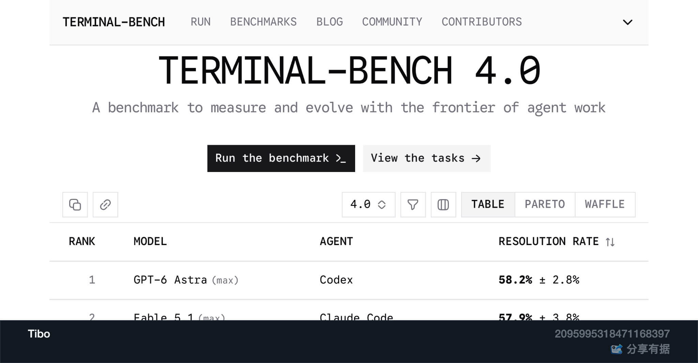
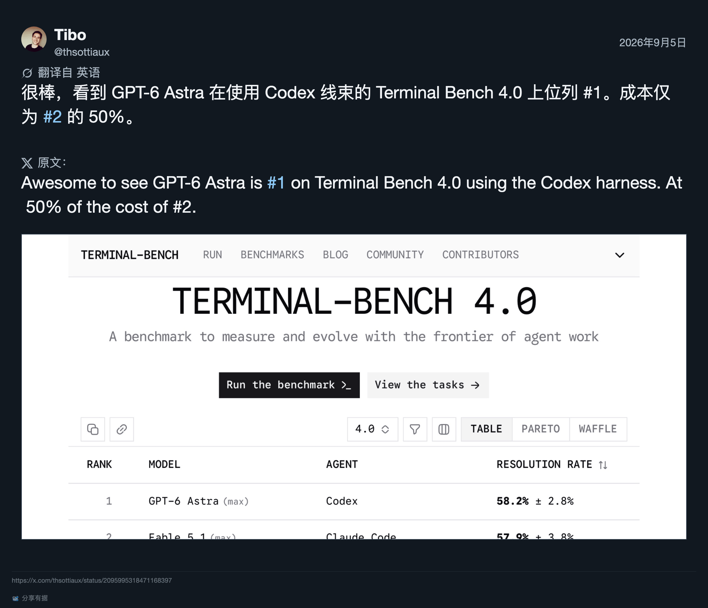
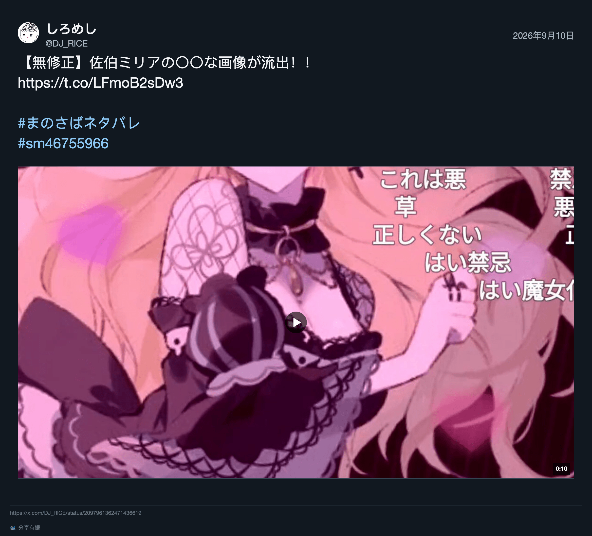
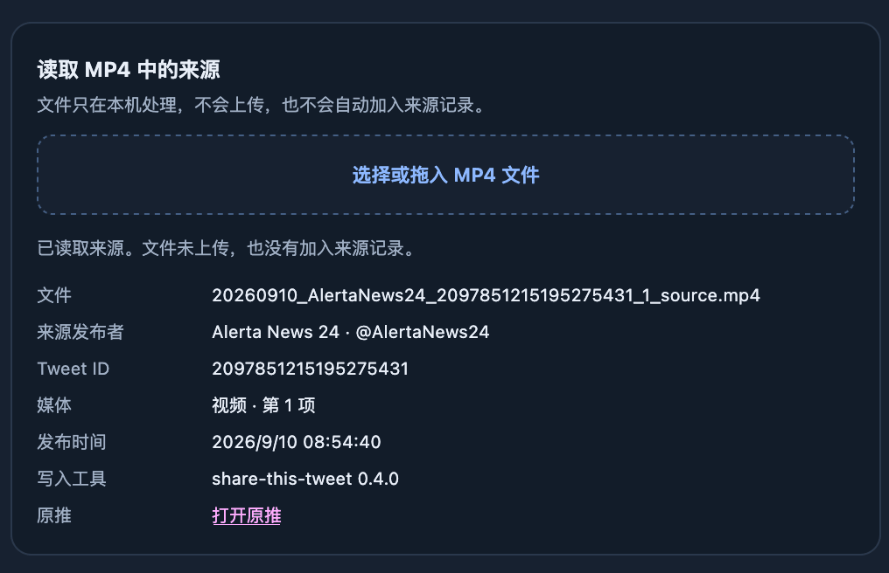
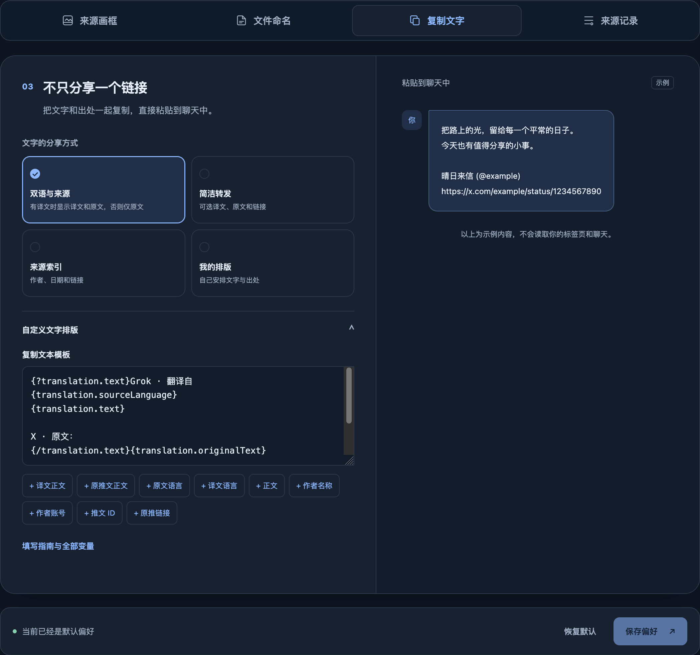
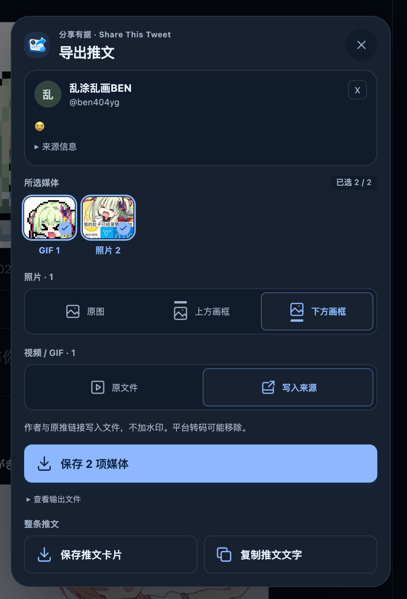

<p align="center">
  
</p>

<h1 align="center">分享有据 · Share This Tweet</h1>

<p align="center">分享喜欢，也留下出处。</p>

<p align="center">
  <a href="CHANGELOG.md"></a>
  
  
  <a href="LICENSE"></a>
</p>

将 X 推文整理成卡片，为图片加上来源画框，按你的习惯复制文字与链接。也能直接下载原图、视频和 GIF，为视频文件留下可找回的出处，方便分享到其他平台。

适用于桌面 Firefox，也支持 Firefox Android。

当前版本 **v0.4.0** · [下载安装包](https://github.com/star-whisper9/share-this-tweet/releases) · [安装说明](#安装) · [更新记录](CHANGELOG.md)

> [!IMPORTANT] 出处与版权
> 保留出处的初衷是分享能留下正确署名。
> **这不代表你自动获得了原作者授权**，你仍应在合理的、不侵犯原作者权益的情况下分享 TA 们的作品！

## 保存内容，也保留来源

### 给图片加上来源画框

在图片上方或下方添加作者与来源信息，方便分享后找回原推文。画框自动适配明暗主题，也支持透明图片。

照片可以选择“原图”“上方画框”或“下方画框”。多张照片一起选好，再点击一次保存即可。

| 亮色 · 上方画框                                  | 暗色 · 下方画框                                 |
| ------------------------------------------------ | ----------------------------------------------- |
|  |  |

### 把推文存成卡片

将正文、作者、时间、媒体预览和来源链接整理成一张 PNG。纯文字推文也能保存；引用推文会一并呈现，支持一层引用。

照片、视频和 GIF 按原顺序排列。视频使用已有封面，并显示播放标记和已知时长；GIF 显示类型标记。卡片是静态图片，想保留完整视频或动图，可以单独下载媒体。

X 提供译文时，卡片会同时保留译文和原文，阅读与对照都方便。明暗主题自动适配，来源放在底部脚注中。



<sub>译文、原文、媒体，一步到位</sub>


<sub>引用推文也不在话下</sub>



<sub>视频封面与时长也能保留在推文卡片中</sub>

### 视频和 GIF，也能带着出处保存

直接下载推文中的视频与 GIF，无需跳转第三方下载网站。两者都保存为 MP4；GIF 保留动态内容，文件格式为视频。

保存时可以选择：

- **原文件**：直接下载 X 提供的媒体文件。
- **写入来源**：将来源发布者、原推链接等信息写入文件，不加水印，不改画面与声音，也不重新压制视频。

收到或保存过的文件，可以在设置页的“来源记录”中选择或拖入，查看本扩展写入的来源，再打开原推文。文件只在本机读取，不会上传。

内嵌来源适合保留文件时追溯出处，平台转码后可能被移除。分享到其他平台时，仍可以配上作者和原推链接。



### 按你的习惯复制和命名

复制推文文字时，可以自由组合原文、译文、作者和链接；保存文件时，也能自定义命名规则。

设置页提供预设、变量填写指南、快捷插入与预览，无需从零编写模板。已保存的来源记录可在本地查询、删除，也可导入导出备份。



## 怎么使用

1. 安装后，在 Firefox 中打开 X，点击进入一条推文的**详情页**。
2. 点击“分享有据”的导出入口。点选媒体缩略图，可以选择一项或多项。
3. 按类型选择保存方式：照片选原图或来源画框，视频与 GIF 选原文件或写入来源，然后点击“保存 N 项媒体”。混合选择时，可以同时给照片加画框、给视频写入来源。
4. 想分享整条推文，可以直接“保存推文卡片”或“复制推文文字”。这两项使用整条推文内容，不受媒体勾选影响。

“查看输出文件”会列出当前选择对应的文件名。画框内容、文件命名和复制格式都可以从 Firefox 扩展菜单进入设置后调整。

导出入口仅出现在推文详情页，时间线和搜索结果中不会显示。安装时已经打开的 X 页面，可以刷新后再试。



## 安装

Firefox 附加组件商店（AMO）版本仍在审核中，目前先通过 [GitHub Releases](https://github.com/star-whisper9/share-this-tweet/releases) 提供 **Mozilla 签名的 Unlisted 安装包**。Unlisted 表示自行分发，暂时无法在商店中搜索安装。

在最新版本的 **Assets** 中下载以 **`.xpi`** 结尾的文件，保留原文件直接安装，无需解压。Release 中的源码压缩包用于查看或构建源码。

| 使用环境        | 最低版本 |
| --------------- | -------- |
| 桌面 Firefox    | 140      |
| Firefox Android | 142      |

Android 已进行初步适配，兼容性仍在完善。请使用 Firefox 浏览器打开 X；扩展不会在 X 的独立 App 中运行。

### 桌面 Firefox

1. 从 [Releases](https://github.com/star-whisper9/share-this-tweet/releases) 下载 `.xpi` 安装包。
2. 在 Firefox 中打开“**附加组件和主题**”，或在地址栏输入 `about:addons`。
3. 点击齿轮菜单，选择“**从文件安装附加组件**”，选中刚下载的 `.xpi` 文件。
4. 按提示确认添加，完成后打开 X 推文详情页即可使用。

### Android Firefox

首次从文件安装，需要先解锁 Firefox 内的隐藏安装菜单，也就是通常说的开发者模式：

1. 从 [Releases](https://github.com/star-whisper9/share-this-tweet/releases) 下载 `.xpi` 安装包到手机。
2. 打开 Firefox 菜单 → **设置** → **关于 Firefox**。
3. **快速连续点击 Firefox 标志五次**，解锁隐藏菜单。
4. 返回 Firefox 的设置页，选择新出现的“**从文件安装扩展**”（Install Extension from File）。
5. 在文件选择器中找到刚下载的 `.xpi`，按提示确认添加。
6. 安装后，在 Firefox 中打开 X 推文详情页使用扩展；设置可从浏览器的扩展菜单进入。

这里只需解锁 Firefox 自己的菜单，无需开启 Android 系统开发者选项或 USB 调试。若没有看到安装入口，先确认 Firefox 已更新，再重复点击标志的步骤。以上安装流程可参照 [Mozilla 官方说明](https://extensionworkshop.com/documentation/publish/install-self-distributed/)。

### 如何更新

当前版本**不会自动从 GitHub Releases 更新**。有新版本时，下载新的 `.xpi`，重复对应平台的安装步骤即可，无需先卸载；卸载会影响本地设置与来源记录。

安装后的版本号可能显示为 `0.4.0.1` 这样的四段数字，末尾数字用于区分同一版本的签名安装包。

<details>
<summary>桌面 Firefox：本地构建与临时加载</summary>

准备 Node.js 和 npm，下载项目源码，在项目目录运行：

```sh
npm ci
npm run build
```

打开 `about:debugging#/runtime/this-firefox`，选择“临时载入附加组件”，加载构建生成的 `dist/manifest.json`。

临时加载的扩展会在 Firefox 重启后移除；普通安装需要 Mozilla 签名的扩展包。

</details>

## 使用前了解

- **翻译由 X 提供。** 扩展不会主动请求翻译。没有译文时保留原文；在 X 中手动点击翻译后，无需刷新即可更新导出内容。翻译数据异常时，面板会显示警告。
- **系统分享暂不提供。** Firefox 的文件分享支持及 Android 文本分享存在已知问题，暂不计划实现系统分享按钮。可以复制文字后粘贴，或保存图片后在目标应用中发送。记录可参见 [CHANGELOG](CHANGELOG.md)。
- **视频来源有格式与大小限制。** 写入来源支持 512 MiB 以内的常见 H.264 MP4（可含 AAC 音频）；遇到不支持的格式，可改选“原文件”。本地来源读取支持 2 GiB 以内的文件。
- **留下出处，尊重作者。** 文件中的来源信息方便追溯，但不代表原作者已授权转载。
- **来源记录保存在本地。** 如需迁移或备份，可在设置页导出记录；扩展不提供云同步。
- **X 的页面和数据可能变化。** 如遇到无法读取推文或导出异常，欢迎在仓库 Issues 中反馈，并附上复现步骤与浏览器版本。

## 致谢与许可

开发过程中参考了 [twitter-improvements](https://github.com/usyless/twitter-improvements) 的部分源码和实现思路。本项目独立开发，不基于该项目构建。

采用 [GNU GPL v3](LICENSE) 许可证。
